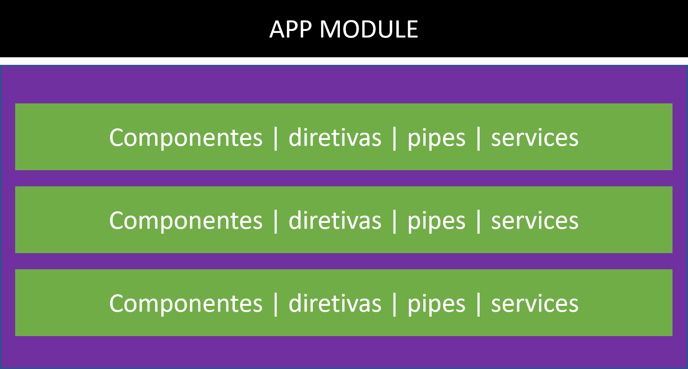
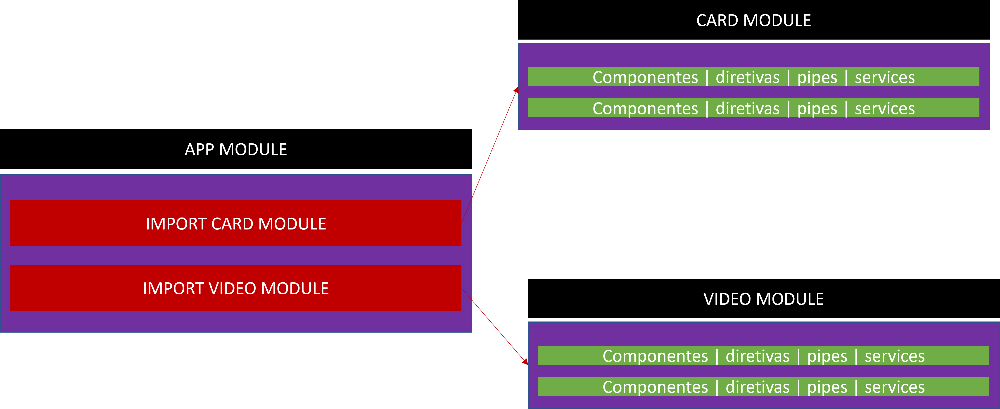
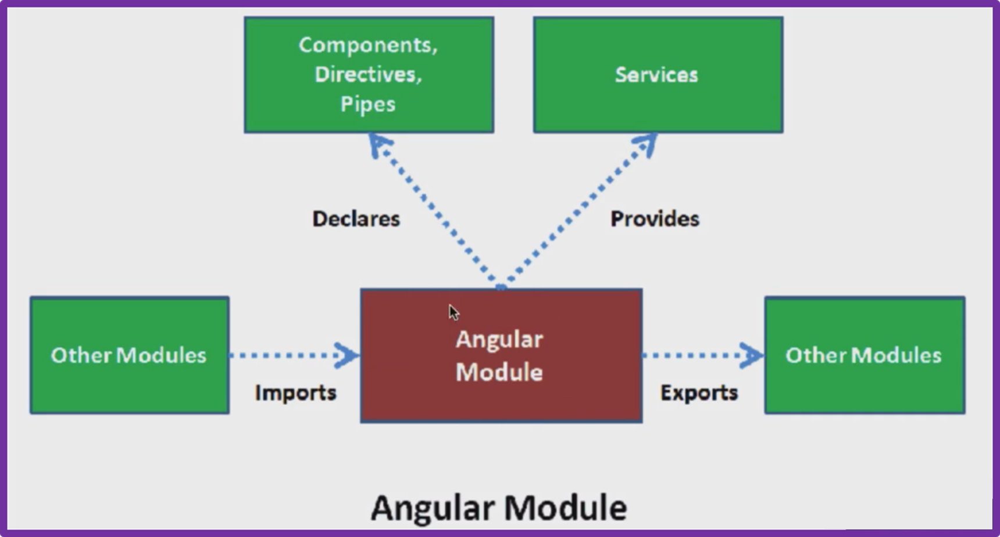

### Módulos Angular


MODULE, guarda componentes. diretivas, pipes e services.
Basicamente é uma caixinha que guardamos os componentes e suas partes lógicas para utilizar na nossa aplicação.

Todo componente precisa estar registrado/associado a um module.


Mas quando o projeto vai crescendo colocar tudo apenas em um module, ficaria desorganizado, então podemos criar submodules, então esses componentes ficaram nas suas caixinhas separadamente e associados a seu module.<br>
Exemplo de submodules:


Anatomia de módulos Angular:



```
import { NgModule } from '@angular/core';//modulos do angular
import { BrowserModule } from '@angular/platform-browser';//navegador

import { AppRoutingModule } from './app-routing.module'; //roteamento do angular
import { AppComponent } from './app.component';

@NgModule({
  declarations: [ //todos os componentes criados
    AppComponent
  ],
  imports: [ //importar outros modules
    BrowserModule,
    AppRoutingModule
  ],
  exports:[], //fornece para outros modules partes especificas de um module
  providers: [], //associar provedores de dados(como o banco de dados)
  bootstrap: [AppComponent] //inicialização, quais são nossos componentes iniciais
})
export class AppModule { }
```