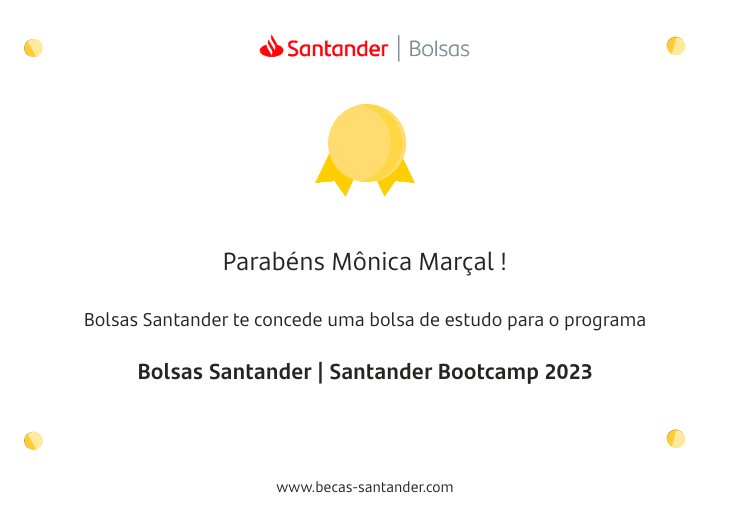

<h1 align="center">Bootcamp Santander + Digital Innovation One</h1>

O Santander Bootcamp 2023 é um programa online e 100% gratuito para você aprender a programar de uma forma prática, fácil e interativa.

_____________________________________________________________________________________________________

##### CRONOGRAMA:
O processo seletivo objeto do presente Edital seguirá o cronograma abaixo,
que poderá sofrer alterações a único e exclusivo critério da ORGANIZADORA: 
1) Inscrições e Teste de Conhecimento: 29/05/2023 à 31/07/2023 
2) Santander Dev Week: 24/07/2023 à 27/07/2023 
3) Seleção de candidatos: 01/08/2023 à 04/08/2023 
4) Divulgação dos aprovados: 07/08/2023 
5) Aceite na Bolsa: 07/08/2023 à 13/08/2023 
6) Início do Bootcamp: 16/08/2023 
7) Último dia para finalizar o bootcamp: 22/10/2023 

##### CARGA HORÁRIA DOS CURSOS:
1) FullStack Angular & Java (120h) 
2) Backend Java (80h) 
3) Ciência de Dados com Python (80h) 
4) Mobile Android com Kotlin (80h) 
5) Mobile iOS com Swift (80h) 
6) Mobile com Flutter (80h) 

##### METODOLOGIA BASEADA NESSES 5 PILARES:

1) Aulas Síncronas (Mentorias ao vivo com experts DIO e Santander) 
2) Aulas Assíncronas (Conteúdo gravado pela equipe DIO) 
3) Desafios de Código (Treinar Algoritimos e Pensamento Computacional) 
4) Desafios de Projeto (Criar Projetos de Ponta a Ponta) 
5) Social Learning e Active Learning (Rooms and Forums) 

##### CURSO ESCOLHIDO DA TRILHA: (FullStack Angular & Java) - Módulos:  
1) Prepare-se Para a Jornada (Onboarding) 
2) Princípios de Desenvolvimento de Software 
3) Primeiras Páginas Interativas com JavaScript 
4) Ganhando Produtividade com a Plataforma Angular 
5) Trabalhando com Rotas e Serviços no Angular 
6) Dominando a Linguagem de Programação Java 
7) Primeiros Passos em SQL e NoSQL 
8) Ganhando Produtividade com Spring Framework e Java 

<h3 align="center"> 🚀 Acompanhe: <a href="https://www.dio.me/en" target="_blank">Digital Innovation One </a> E 
<a href="https://www.becas-santander.com/pt_br/index.html?program=Bolsas+Santander+%7C+Santander+Bootcamp+2023&id=64467679ca087cb323bc1581&sharedId=64d25ac74f460c6e1f46b82a&doc=a523jll2ftxoa" target="_blank">Santander Bolsas 🚀 </a></h3>
 

